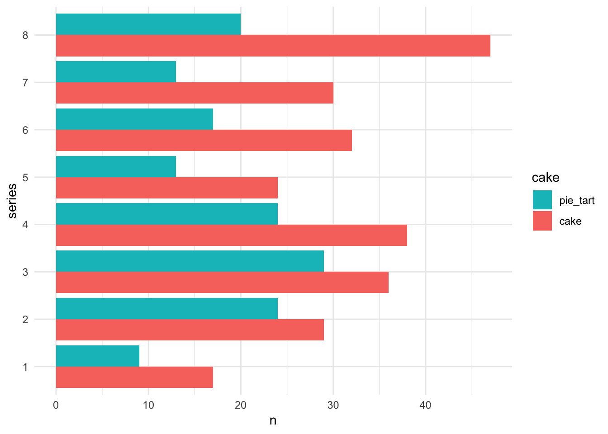

This is a lesson on tidying data, remixed from [Jenny Bryan's similar lesson using "Lord of the Rings" data](https://github.com/jennybc/lotr-tidy). Most text + code is Jenny's, basically we plopped a new dataset in there 😉

---


<blockquote class="twitter-tweet" lang="en"><p>If I had one thing to tell biologists learning bioinformatics, it would be &quot;write code for humans, write data for computers&quot;.</p>&mdash; Vince Buffalo (@vsbuffalo) <a href="https://twitter.com/vsbuffalo/statuses/358699162679787521">July 20, 2013</a></blockquote>

An important aspect of "writing data for computers" is to make your data __tidy__. Key features of __tidy__ data:

  * Each column is a variable
  * Each row is an observation

If you are struggling to make a figure, for example, stop and think hard about whether your data is __tidy__. Untidiness is a common, often overlooked cause of agony in data analysis and visualization.

## GBBO example {.tabset}

We will give you a concrete example of some untidy data from ["The Great British Bake Off"](https://github.com/apreshill/bakeoff).

### Series 1


Table: Series 1

challenge      cake   pie_tart
------------  -----  ---------
showstopper       5          5
signature        12          4

### Series 2


Table: Series 2

challenge      cake   pie_tart
------------  -----  ---------
showstopper       8         17
signature        21          7

### Series 3


Table: Series 3

challenge      cake   pie_tart
------------  -----  ---------
showstopper      12         17
signature        24         12


We have one table per series. In each table, we have the total number of bakes, by challenge and type (cake versus pie/tart).

You could imagine finding these separate tables as separate worksheets in an Excel workbook. Or hanging out in some cells on the side of a worksheet that contains the underlying raw data. Or as tables on a webpage or in a Word document.

This data has been formatted for consumption by *human eyeballs* (paraphrasing Murrell; see Resources). The format makes it easy for a *human* to look up the number of showstopper cakes baked in Series 2. But this format actually makes it pretty hard for a *computer* to pull out such counts and, more importantly, to compute on them or graph them.

## Exercises

Look at the tables above and answer these questions:

  * What is the total number of cakes baked in signature challenges?
  * Do pies and tarts dominate cakes in any series? Does the dominant type of bake differ across the series?
  
How well does your approach scale if there were many more series or if I provided you with updated data that includes all possible bakes (custards, buns, etc.)?

## Tidy Bake Off data

Here's how the same data looks in tidy form:

<!--html_preserve--><div id="htmlwidget-e36890d43bfe06217bcd" style="width:100%;height:auto;" class="datatables html-widget"></div>
<script type="application/json" data-for="htmlwidget-e36890d43bfe06217bcd">{"x":{"filter":"none","data":[["1","2","3","4","5","6","7","8","9","10","11","12","13","14","15","16","17","18","19","20","21","22","23","24","25","26","27","28","29","30","31"],["1","1","1","1","2","2","2","2","3","3","3","3","4","4","4","4","5","5","5","5","6","6","6","7","7","7","7","8","8","8","8"],["showstopper","showstopper","signature","signature","showstopper","showstopper","signature","signature","showstopper","showstopper","signature","signature","showstopper","showstopper","signature","signature","showstopper","showstopper","signature","signature","showstopper","signature","signature","showstopper","showstopper","signature","signature","showstopper","showstopper","signature","signature"],["cake","pie_tart","cake","pie_tart","cake","pie_tart","cake","pie_tart","cake","pie_tart","cake","pie_tart","cake","pie_tart","cake","pie_tart","cake","pie_tart","cake","pie_tart","cake","cake","pie_tart","cake","pie_tart","cake","pie_tart","cake","pie_tart","cake","pie_tart"],[5,5,12,4,8,17,21,7,12,17,24,12,27,9,11,15,20,6,4,7,12,20,17,19,3,11,10,26,12,21,8]],"container":"<table class=\"display\">\n  <thead>\n    <tr>\n      <th> <\/th>\n      <th>series<\/th>\n      <th>challenge<\/th>\n      <th>cake<\/th>\n      <th>bakes<\/th>\n    <\/tr>\n  <\/thead>\n<\/table>","options":{"columnDefs":[{"className":"dt-right","targets":4},{"orderable":false,"targets":0}],"order":[],"autoWidth":false,"orderClasses":false}},"evals":[],"jsHooks":[]}</script><!--/html_preserve-->

Notice that tidy data is generally taller and narrower. It doesn't fit nicely on the page. Certain elements get repeated a lot, e.g. `showstopper`. For these reasons, we often instinctively resist __tidy__ data as inefficient or ugly. But, unless and until you're making the final product for a textual presentation of data, ignore your yearning to see the data in a compact form.

## Benefits of tidy data

With the data in tidy form, it's natural to *get a computer* to do further
summarization or to make a figure. This assumes you're using a language that is "data-aware", which R certainly is. Let's answer the questions posed above.

#### What's the total number of cakes baked in signature challenges?


```r
bakes_tidy %>% 
 count(challenge, cake, wt = bakes, sort = TRUE)
#> # A tibble: 4 x 3
#>   challenge   cake         n
#>   <chr>       <chr>    <int>
#> 1 showstopper cake       129
#> 2 signature   cake       124
#> 3 signature   pie_tart    80
#> 4 showstopper pie_tart    69
## outside the tidyverse:
#aggregate(Words ~ Gender, data = lotr_tidy, FUN = sum)
```

Now it takes a small bit of code to compute the total number of cakes for each challenge across all series. The total number of cakes baked in signature challenges is 124. It was important here to have all bake counts in a single variable, within a data frame that also included variables for challenge and type of bake.

####  Do pies and tarts dominate any series? Does the dominant type of bake differ across the series?

First, we sum across challenges, to obtain bake counts for the different series across episodes/challenges.


```r
(bakes_by_series <- bakes_tidy %>% 
   count(series, cake, wt = bakes))
#> # A tibble: 16 x 3
#>    series cake         n
#>    <fct>  <chr>    <int>
#>  1 1      cake        17
#>  2 1      pie_tart     9
#>  3 2      cake        29
#>  4 2      pie_tart    24
#>  5 3      cake        36
#>  6 3      pie_tart    29
#>  7 4      cake        38
#>  8 4      pie_tart    24
#>  9 5      cake        24
#> 10 5      pie_tart    13
#> 11 6      cake        32
#> 12 6      pie_tart    17
#> 13 7      cake        30
#> 14 7      pie_tart    13
#> 15 8      cake        47
#> 16 8      pie_tart    20
## outside the tidyverse:
#(by_race_film <- aggregate(Words ~ Race * Film, data = lotr_tidy, FUN = sum))
```

We can stare hard at those numbers to answer the question. But even nicer is to depict the bake counts we just computed in a barchart. 


```r
ggplot(bakes_by_series, aes(x = series, y = n, fill = cake)) +
  geom_col(position = "dodge") +
  coord_flip() + 
  guides(fill = guide_legend(reverse = TRUE))
```

<!-- -->

Or we can make a line chart...

```r
ggplot(bakes_by_series, aes(x = series, y = n, 
                            color = cake,
                            group = cake)) +
  geom_point() +
  geom_line() +
  expand_limits(y = 0)
```

<!-- -->


So cakes are king, at least relative to pies/tarts, across all series. Pies/tarts saw a spike in popularity around series 3. Cakes really surged in the last series, series 8.

One thing missing from this data is information about total number of participants/bakes across each series, so that we can calculate proportions. 

Again, it was important to have all the data in a single data frame, all bake counts in a single variable, and associated variables for challenge and type of bake.

## Take home message

Having the data in __tidy__ form was a key enabler for our data aggregations and visualization.

Tidy data is integral to efficient data analysis and visualization.

If you're skeptical about any of the above claims, it would be interesting to get the requested word counts, the barchart, or the insight gained from the chart *without* tidying or plotting the data. And imagine redoing all of that on the full dataset.

### Where to next?

In [the next lesson](02-gather.md), we'll show how to tidy this data.

Our summing over challenges to get counts for combinations of series and cake is an example of __data aggregation__. It's a frequent companion task with tidying and reshaping. Learn more at:

  * Simple aggregation with the tidyverse: `dplyr::count()` and `dplyr::group_by()` + `dplyr::summarize()`, [STAT 545 coverage](http://stat545.com/block010_dplyr-end-single-table.html#group_by-is-a-mighty-weapon), [Data transformation](http://r4ds.had.co.nz/transform.html) chapter in R for Data Science.
  * General aggregation with the tidyverse: [STAT 545 coverage](http://stat545.com/block024_group-nest-split-map.html) of general Split-Apply-Combine via nested data frames.

These figures were made with `ggplot2`, a popular package that implements the Grammar of Graphics in R.

### Resources

  * [Tidy data](http://r4ds.had.co.nz/tidy-data.html) chapter in R for Data Science, by Garrett Grolemund and Hadley Wickham
    - [tidyr](https://github.com/hadley/tidyr) R package
    - The tidyverse meta-package, within which `tidyr` lives: [tidyverse](https://github.com/hadley/tidyverse).
  * [Bad Data Handbook](http://shop.oreilly.com/product/0636920024422.do) by By Q. Ethan McCallum, published by O'Reilly.
    - Chapter 3: Data Intended for Human Consumption, Not Machine Consumption by Paul Murrell.
  * Nine simple ways to make it easier to (re)use your data by EP White, E Baldridge, ZT Brym, KJ Locey, DJ McGlinn, SR Supp. *Ideas in Ecology and Evolution* 6(2): 1–10, 2013. doi: 10.4033/iee.2013.6b.6.f <https://ojs.library.queensu.ca/index.php/IEE/article/view/4608>
    - See the section "Use standard table formats"
  * Tidy data by Hadley Wickham. Journal of Statistical Software. Vol. 59, Issue 10, Sep 2014. <http://www.jstatsoft.org/v59/i10>
